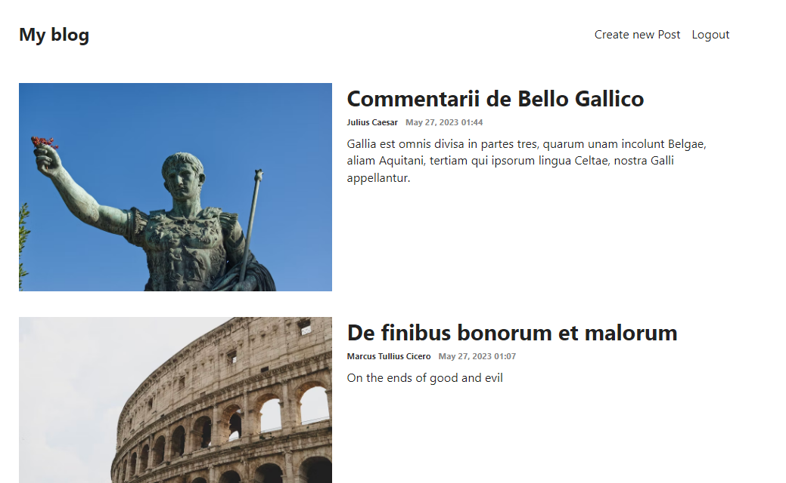
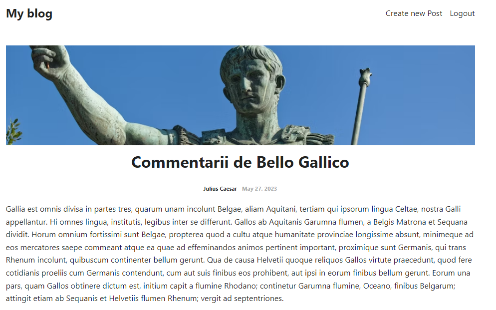
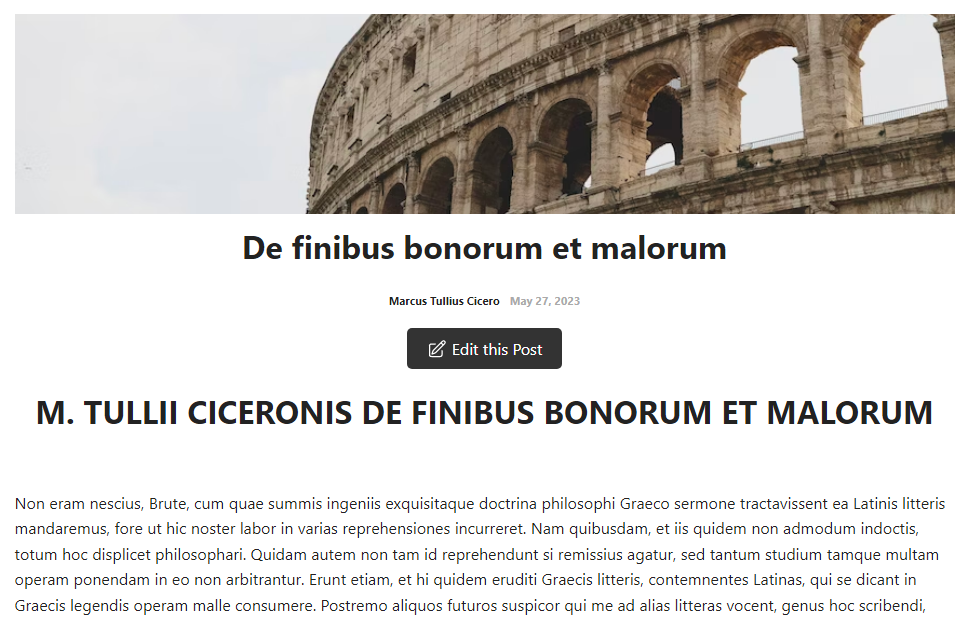

# Blog App

Welcome to the Blog App! This is a web application built using JavaScript, React, Express, Node.js, and MongoDB. It allows users to read articles posted by others, register, login, create their own articles, and edit them.

## Installation
1. Clone the repository: `git clone https://github.com/GingFreecss2/MERN-Blog-App.git`
2. Navigate to the API directory: `cd api`
3. Install the dependencies: `yarn install`
4. Start the API server: `nodemon index.js`
5. Open a new terminal window/tab
6. Navigate to the Client directory: `cd client`
7. Install the dependencies: `yarn install`
8. Start the React development server: `yarn start`

## Usage
- Access the application in your web browser at `http://localhost:3000`.
- Users can browse articles, register, and login.
- Authenticated users can create their own articles and edit them.

## Project Structure
- The API folder contains the backend code for the application.
- The `index.js` file in the API folder is the entry point for the API server.
- The `models` folder in the API folder contains the Mongoose models for User and Post.
- The Client folder contains the frontend code for the application.

## Features
- User registration and login functionality
- Ability to create and edit articles
- View articles posted by other users
- Responsive design for mobile and desktop devices

## Technologies Used
- React
- Express
- Node.js
- MongoDB

## Screenshots

### Home Page

### Article Details

### Edit Button for Authors
- Authors of articles have the ability to edit their own articles.

## Acknowledgements
- [React](https://reactjs.org/)
- [Express](https://expressjs.com/)
- [Node.js](https://nodejs.org/)
- [MongoDB](https://www.mongodb.com/)

---

Thank you for checking out the Blog App! If you have any questions or need further assistance, please feel free to reach out.
